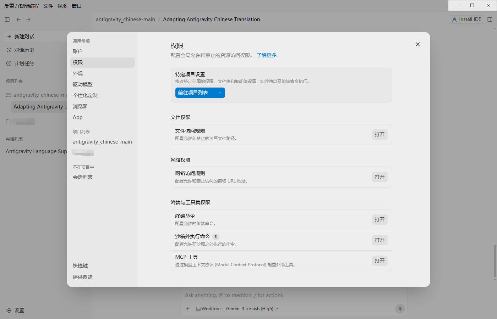

# Antigravity 2.0 简体中文汉化语言包 & 注入引擎

<p align="center">
  
</p>

<p align="center">
  <a href="https://github.com/yuanhhs/antigravity-chinese/releases/latest"></a>
  <a href="#"></a>
  <a href="#"></a>
  <a href="#"></a>
  <a href="./LICENSE"></a>
</p>

---

> [!NOTE]
> **适用版本**：**Antigravity v2.15.1**（深度向下兼容 v2.12.x 及以上版本）  
> **核心引擎**：纯原生 Node.js（无需 Python，零外部依赖，极速极稳）  
> **覆盖范围**：涵盖主界面、系统菜单栏、托盘右键菜单、设置中心、智能体对话面板、新手引导及加载动画。  
> **底层原理**：**源码级 AST 精准汉化**——在 Chrome DevTools Protocol 拦截层直接解析前端 bundle（`main.js`），按语法树定位并替换界面文案字面量；**会话框渲染库（KaTeX 公式 / Markdown 管线 / diff 等）设立独立沙箱保护区**，绝不触碰聊天记录、代码块、文件名与终端，确保零误伤、无污染、完美可逆。

---

## 📸 汉化效果展示

### 1. 欢迎页与登录新手引导


### 2. 主编辑器界面与菜单


### 3. 详细参数设置面板


---

## ✨ 核心亮点

* 🎯 **源码级 AST 精准替换**：抛弃旧时代的 DOM 暴力遍历与 MutationObserver 拦截，从源头解析前端 AST 语法树，精确定位 JSX children、标签属性（label、title、placeholder）与模板字符串，界面文案 100% 自然呈现。
* 🛡️ **会话安全沙箱保护区**：将 KaTeX 数学公式渲染器、remark / rehype / micromark Markdown 解析管线、diff 比较器等第三方库整段划入**保护区**。区内既不提取词条也不做任何字面量改动，彻底杜绝公式字体报错（如 `Font metrics not found`）与排版变形。
* 🔒 **代码与终端零误伤**：不碰聊天内容、代码高亮、控制台输出、文件树路径，彻底解决传统汉化插件容易把“代码/命令翻译掉”的行业痛点。
* ⚡ **极速冷启动与智能缓存**：采用 `ETag + 字典哈希 + 核心引擎哈希` 多维缓存机制，首次解析后秒级落盘，二次启动完全零延迟。
* 🤖 **AI 驱动敏捷维护**：首创结合 Antigravity 自身的 AI 协作补翻模式；附带 `tools/extract_src_strings.js` 自动化对比工具，软件升级后数秒内即可生成待翻清单。
* 🍏 **跨平台与安全还原**：支持 Windows 与 macOS。一键安装脚本内置进程检测、自动备份原始 `app.asar.bak` 与 macOS 深度 Ad-hoc 自动重签名机制，卸载一键瞬间还原。

---

## 📂 项目结构说明

```plaintext
antigravity-chinese/
├── 双击运行中文汉化工具.bat      # Windows 一键执行入口（安装 / 卸载）
├── 双击运行中文汉化工具.command  # macOS 一键执行入口（含权限提升与自动重签名）
├── localization_engine.js      # 核心注入与解包打包引擎
├── terminology.js              # 术语策略过滤器（保持 Git 英文规范、审校统一）
├── README.md                   # 本说明文档
├── dicts_src/                  # 源码级分层字典库
│   ├── 00_common.json          # 全局通用高频词条
│   ├── 10_settings_permissions.json # 设置中心与权限选项
│   ├── 40_browser_terminal_files.json # 终端、浏览器与文件树
│   ├── 50_agent_conversation.json # 智能体、对话与提示词
│   ├── 60_misc_a.json          # 综合杂项 A
│   ├── 61_misc_b.json          # 综合杂项 B
│   ├── 70_v2.15.json           # v2.15.x 增量补翻词库
│   ├── 90_fixups.json          # 最终人工修正与强制微调表
│   └── 95_scoped_identifiers.json # 作用域路由标识符（带 scope 标记）
├── src_layer/                  # 源码注入层运行时（安装时打包入 asar）
│   ├── acorn.js                # 高性能 AST 语法解析器 (MIT)
│   ├── agy_src_i18n.js         # AST 遍历、保护区判定与词条替换核心
│   └── bootstrap.js            # 主进程 CDP Fetch 拦截钩子与缓存管理器
└── tools/
    └── extract_src_strings.js  # 自动化版本对比与待翻清单生成工具
```

---

## 🚀 极速安装指南

### 1. 获取汉化包（推荐二选一）

* **方式 A：下载 Release 压缩包（最便捷 📦）**
  1. 前往 GitHub 的 [**Releases 发布页面**](https://github.com/yuanhhs/antigravity-chinese/releases)；
  2. 下载最新的 `Antigravity-Chinese-v2.15.1.zip`；
  3. 解压到本地任意目录（例如 `下载` 文件夹）。

* **方式 B：通过 Git 命令行克隆（开发者推荐 💻）**
  ```bash
  git clone https://github.com/yuanhhs/antigravity-chinese.git
  ```

---

### 2. 一键安装中文汉化

1. **完全退出** Antigravity 软件（可在任务管理器或活动监视器中确认已退出）。
2. 打开解压或克隆的文件夹：
   - **Windows**：双击运行 **`双击运行中文汉化工具.bat`**。
   - **macOS**：双击运行 **`双击运行中文汉化工具.command`**。
3. 终端弹出菜单后，输入 **`1`** 并按回车（默认即为安装）。
4. 看到“汉化已完成”提示后，重新打开 Antigravity，即可畅享全中文界面！

> [!TIP]
> 高级用户也可以直接使用命令行调用引擎：
> ```bash
> node localization_engine.js                       # 自动探测安装路径并安装
> node localization_engine.js --install-dir <路径>   # 手动指定 Antigravity 安装目录
> node localization_engine.js --huifu               # 卸载还原官方原版英文
> ```

---

### 3. 一键卸载与还原官方英文

1. **完全退出** Antigravity 软件。
2. 运行 **`双击运行中文汉化工具.bat`**（Windows）或 **`双击运行中文汉化工具.command`**（macOS）。
3. 选择 **`[2] 卸载汉化，还原官方英文`**。
4. 引擎将自动使用首次备份的 `app.asar.bak` 无损还原应用，并自动清理运行时译文缓存。

---

## 🛠️ 深度技术原理

Antigravity 2.x 的界面渲染架构与常规 Electron 应用不同：其界面代码并未直接打包在 `app.asar` 中，而是在启动后由后台 `language_server` 通过本地 HTTPS 动态分发给前端窗口。

```
                       ┌──────────────────────────────────────┐
                       │  language_server (动态分发 main.js)   │
                       └──────────────────┬───────────────────┘
                                          │
                                          ▼
┌────────────────────────────────────────────────────────────────────────┐
│ 主进程 CDP Fetch 域拦截 (src_layer/bootstrap.js)                        │
│                                                                        │
│   1. 检查 ETag + 字典哈希缓存 ──► [命中] ──► 直接返回缓存改写脚本         │
│   2. [未命中] ──► Acorn AST 解析 ──► 识别渲染保护区 ──► 精确替换字面量   │
└──────────────────────────────────┬─────────────────────────────────────┘
                                   │
                                   ▼
                       ┌──────────────────────┐
                       │   窗口渲染前端界面    │
                       │   (纯中文，0 DOM 损耗) │
                       └──────────────────────┘
```

1. **CDP 精准拦截**：主进程通过 Chrome DevTools Protocol 仅对匹配 `/main.js` 的请求进行拦截，其余所有网络与本地流量原样通行。
2. **AST 语义级改写**：使用 Acorn 解析 JavaScript AST，仅对作为界面标签、占位符、对话引导等文案字面量进行替换；对于涉及内部路由与状态逻辑的键名，字典采用 `scope: "all"` 语法实施全包一致性符号重命名。
3. **第三方渲染库隔离区**：自动识别 KaTeX、react-dom、remark/rehype、lodash 等库的顶层语句块，划定保护范围，确保会话内的公式与排版毫发无损。

---

## 🤖 借助 AI 助手自动补充与定制汉化

如果您在使用中发现漏翻的英文或希望调整用词，**可以直接让 Antigravity 窗口里的 AI 帮您修改字典**！

### 💡 最佳实践姿势
1. 在 Antigravity 中点击 **“文件 (File) -> 打开文件夹 (Open Folder)”**，直接将本汉化包仓库所在目录作为工作区打开；
2. 直接在聊天界面发送指令（附带截图或文本）：

#### 模板 1：直接粘贴截图 📸
> **“请帮我查看这张截图，把里面所有未汉化的英文面板与选项内容，提取并增补到 dicts_src 字典中。”**

#### 模板 2：指定文字翻译 ✍️
> **“帮我把漏译的英文文案 'Allow agent to run terminal commands automatically' 翻译为 '允许智能体自动运行终端命令' 并保存到字典。”**

3. AI 写入字典后，完全退出 Antigravity，重新双击运行安装脚本，重启软件即可立刻生效！

---

## 📝 极客进阶：软件升级后如何快速补翻

当 Antigravity 升级新版本时（例如从 2.15.1 升级到后续版本），您只需：

1. 升级后先运行一次 **`双击运行中文汉化工具`**（旧词条瞬间生效）；
2. 保持软件运行，在终端执行对比工具：
   ```bash
   node tools/extract_src_strings.js
   ```
   工具会自动从本地抓取当前最新 `main.js`，与现有字典比对，并在控制台输出统计：
   - 自动生成 `temps/pending_<版本号>.json`（**待翻清单**，相近词条已智能预填）；
   - 导出 `temps/src_candidates.zone_only.json`（保护区内部词条，提示可清理项）。
3. 将清单中英文翻译补充后另存为 `dicts_src/70_v<新版本>.json`；
4. 再次运行安装脚本，即可实现无缝持续汉化！

---

## ❓ 常见问题排查 (FAQ)

### Q1：运行提示“解包失败”或缺少环境？
* 本汉化引擎采用纯 Node.js 编写，Antigravity 本身就是 Electron 架构，大部分电脑均已具备运行环境。若提示缺少 Node，只需前往 [Node.js 官方网站](https://nodejs.org/) 安装 LTS 版本即可。

### Q2：macOS 提示“应用已损坏”或无法打开？
* macOS 会校验应用签名。本汉化工具在安装完成后会自动调用 `codesign --force --deep -s -` 对应用执行 Ad-hoc 深度重签名。
* 若首次双击 `.command` 提示权限不足，可在终端中执行：`chmod +x *.command`；若提示系统安全拦截，请在“系统设置 -> 隐私与安全性”中点击“仍要打开”。

### Q3：Windows 提示文件占用或权限不足？
* 请确保 Antigravity 已完全退出（检查任务栏右下角托盘图标）。建议右键点击 `双击运行中文汉化工具.bat` 选择 **“以管理员身份运行”**。

### Q4：官方软件推送更新后，汉化丢失了？
* 软件升级后官方会替换 `app.asar`。无需重新下载汉化包，只需退出软件，重新双击运行 **`双击运行中文汉化工具.bat`** 再次点击安装即可恢复。

### Q5：界面仍是英文，但顶部菜单已经中文？
* 检查是否有开发者工具窗口处于打开状态导致调试端口冲突（Debugger attach conflict），关闭开发者工具并重启软件即可；
* 也可在 `%APPDATA%\Antigravity\logs\main.log`（macOS 对应 `~/Library/Application Support/Antigravity/logs/main.log`）中查看带 `[agy-zh]` 标识的启动日志以排查原因。

---

## 📄 开源许可证

本项目遵循 [MIT License](./LICENSE) 开源协议。核心源码级语法解析器基于 [Acorn](https://github.com/acornjs/acorn)（MIT License）。

---

## 🤝 致谢

感谢所有在 issue、PR 中提出宝贵建议与测试反馈的朋友们！欢迎 Star ⭐ 支持与共同完善。
